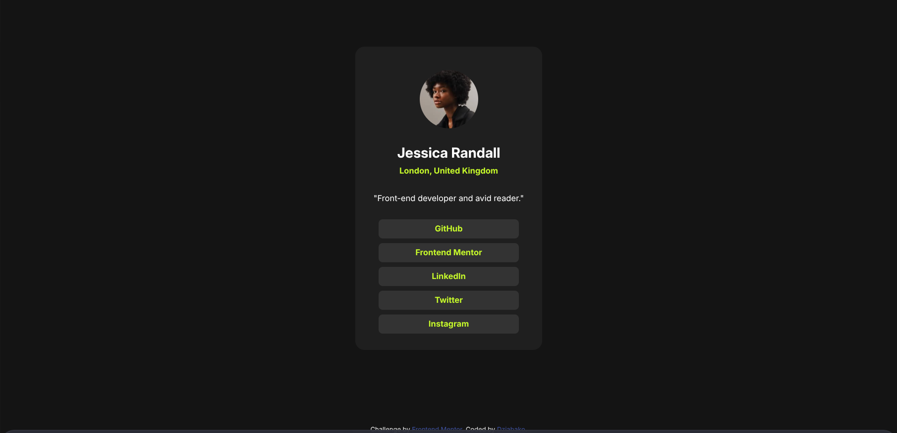

# Frontend Mentor - Results summary component solution

This is a solution to the [Results summary component challenge on Frontend Mentor](https://www.frontendmentor.io/challenges/results-summary-component-CE_K6s0maV). Frontend Mentor challenges help you improve your coding skills by building realistic projects. 

## Table of contents

- [Overview](#overview)
  - [The challenge](#the-challenge)
  - [Screenshot](#screenshot)
  - [Links](#links)
- [My process](#my-process)
  - [Built with](#built-with)
  - [What I learned](#what-i-learned)
  - [Continued development](#continued-development)
  - [Useful resources](#useful-resources)
- [Author](#author)

## Overview

### The challenge

Users should be able to:

- View the optimal layout for the interface depending on their device's screen size
- See hover and focus states for all interactive elements on the page
- **Bonus**: Use the local JSON data to dynamically populate the content

### Screenshot

### Links

- Live Site URL: [URL](https://dziabako.github.io/ResultSummaryComponent/)

## My process
1. At the beggining I added html tags and classes to the elements
2. Started working on each element starting from the biggest one ("container" class finishing on images)
3. Created responsive desktop and mobile view
4. After finishing all above I started to work on README.md

### Built with

- Semantic HTML5 markup
- CSS custom properties
- Flexbox
- Media Query

### What I learned

I reinforced my css skills

### Continued development

Continue working on making more "pretty" css and html code, work more on new css possibilities, at some point also to start adding js and also some Python code (I am familiar with python-flask, flask-wtf, flask-login, flask-sqlalchemy)

### Useful resources

GitHub Copilot 

## Author

- Website - [@Dziabako](https://github.com/Dziabako)
- Frontend Mentor - [@Dziabako](https://www.frontendmentor.io/profile/Dziabako)

